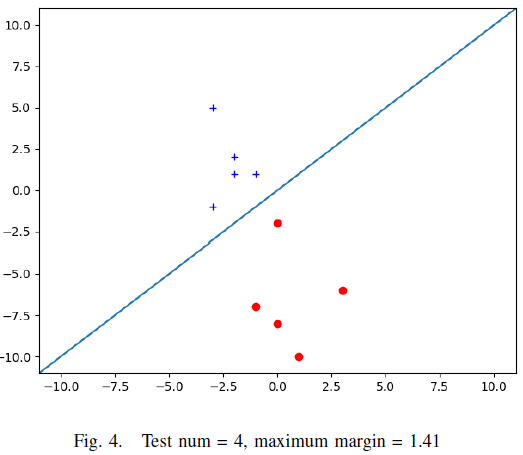
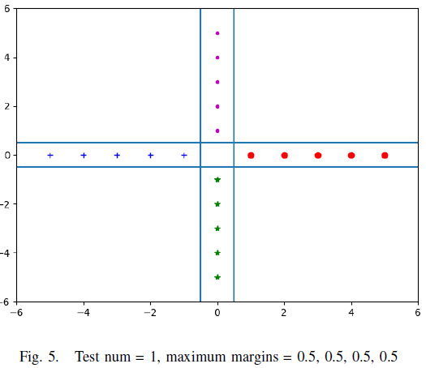
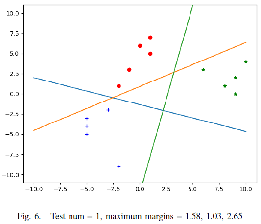

# SVM

Support Vector Machines (SVMs) are a powerful supervised machine learning algorithm commonly used for classification and regression. This project solves binary and multi-class classification problems via SVM algorithm.

### helpers.py
Includes data generation and plotting functions. 

### svm.py

Includes several functions that can find support vectors and make the classification. 

#### *svm_train_brute()*

This function finds support vectors and decision boundaries using helper functions. It works with 2D data. In 2D data, we can only have two or three support vectors. So, this function search for all possible combinations of data for support vectors.

* 1 positive - 1 negative points
* 2 positive - 1 negative points
* 1 positive - 2 negative points

#### *distance_point_to_hyperplane()*

This function basically returns absolute value of distance of a point from the hyperplane.

#### *compute_margin()*
This function computes margin with using return values of the calculated hyperplane.

#### *svm_test_brute()*
This function returns the label of the data point.

If activation result is bigger than zero, then the label returned as positive, otherwise negative.

#### *svm_train_multiclass()*
In this function, "One vs Rest" algorithm applied for multiclass classification. 

## Results

|| ||
| ------------- |:-------------:| -----:|
|| ||
